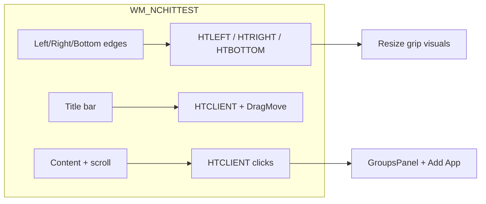
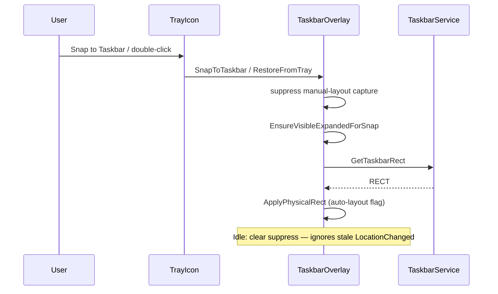

<!-- PRESERVATION RULE: Never delete or replace content. Append or annotate only. -->
# Architecture Overview: TaskSplit

## System Structure
TaskSplit is a C# .NET 9.0 WPF application that uses Win32 API calls to discover and manipulate the Windows Taskbar's button hierarchy. It follows a Service-Model-View pattern for clean separation of concerns.

```mermaid
graph TD
    A[App Entry / Tray Icon] --> B[AppConfig Model]
    B --> C[ConfigService (JSON Persistence)]
    A --> D[TaskbarService (Win32 API)]
    D --> E[Shell_TrayWnd Discovery]
    E --> F[MSTaskListWClass Search]
    D --> G[Window Enumeration Fallback]
    A --> H[TaskbarOverlay UI]
    H --> I[Transparent WPF View]
    I --> J[Group Dividers & Labels]
```

## Key Technologies
- **WPF**: Used for the transparent overlay and the settings UI.
- **Win32 P/Invoke**: Required to find window handles (`HWND`) of the taskbar and its child windows (`MSTaskListWClass`).
- **Native IPC/DWM**: Allows the overlay window to stay pinned above the taskbar but below active windows.

## Discovery Logic
1.  **Find `Shell_TrayWnd`**: The root window for the primary Windows Taskbar.
2.  **Navigate Down**: Drill into `ReBarWindow32` > `MSTaskSwWClass` > `MSTaskListWClass`.
3.  **Enumerate Buttons (HWND)**: Recurse child windows; skip container classes, collect visible leaf HWNDs.
4.  **Win11 fallback (UI Automation)**: If HWND enum returns zero buttons, query `Taskbar.TaskListButtonAutomationPeer` under `Shell_TrayWnd`; map button labels to process names (e.g. `"Cursor - 1 running window pinned"` → `cursor`).
5.  **Reposition**: (Best-effort, future) Use `SetWindowPos` to add pixel offsets matching the configured gaps.
6.  **Overlay Sync**: Panel snaps bottom-aligned above taskbar (≥220px height, half taskbar width). Thin-strip mode draws dividers on canvas; groups panel always lists config.

## [AMENDED 2026-06-25]: Overlay interaction model



- **Manual layout lock** after user drag/resize; 2s timer refreshes groups only (no reposition).
- **Resize grip FX** updated from `WndProc` (NC zones do not receive WPF `MouseMove`). [AMENDED 2026-06-25]: client leave via `TrackMouseEvent`; grips suppressed during `WM_ENTERSIZEMOVE`; title-bar hover only (no full-frame chrome tint); side grips below title bar; bottom dash-only.

## Project Layout (2026-06-25)
| Path | Role |
|------|------|
| `App.xaml.cs` | Tray icon, overlay lifecycle, config load |
| `Services/TaskbarService.cs` | Taskbar HWND discovery & button enumeration |
| `Services/ConfigService.cs` | `%AppData%\TaskSplit\config.json` persistence; `CreateDefault()` seed |
| `Win32/NativeMethods.cs` | P/Invoke wrappers (`FindWindow`, `EnumChildWindows`, `RECT`, etc.) |
| `Views/TaskbarOverlay.xaml` | Overlay panel (groups list, Add App, resize grips, optional dividers) |
| `launch.bat` | Windows dev launcher (`dotnet run`; prepends SDK path for Explorer sessions) |

---

## [AMENDED 2026-06-25]: Product name & extended layout

**Product name:** Task-Split (user-facing). Assembly/namespace remains `TaskSplit`.

Additional components since initial layout:

| Path | Role |
|------|------|
| `Services/AppDiscoveryService.cs` | System exe index + search/browse; `TryDeleteExecutable` |
| `Views/AddAppDialog.xaml` | Add-app search UI; right-click delete from disk |
| `Models/DiscoveredApp.cs` | Search result model |
| `Models/DeleteExecutableResult.cs` | Delete-from-system operation result |
| `Models/OverlayDiagnostics.cs` | Debug overlay report |

## [AMENDED 2026-06-25]: Groups panel & Add App polish

| Path | Role |
|------|------|
| `Models/DiscoveredApp.cs` | Search result + `AddedAt` / `AddedAtLabel` for install recency |
| `Views/TaskbarOverlay.xaml.cs` | Groups panel render, `WndProc` hit-test, resize grip FX, manual layout |
| `DOCS/FEATURES.md` | Prioritized roadmap & possible features |

Planned work: see [FEATURES.md](FEATURES.md).

## [AMENDED 2026-06-25]: Add App — delete from system

Right-click a search result in `AddAppDialog` → **Delete from system…** calls `AppDiscoveryService.TryDeleteExecutable`. Guards: confirmation dialog, blocks `Windows` / `System32` paths, blocks while process is running. Removes file from disk, drops from discovery index, and removes matching `ProcessName` from config groups if assigned.

## [AMENDED 2026-06-25]: Snap / tray restore flow



**Root cause (snap):** `ApplyPhysicalRect` cleared `_applyingAutoLayout` before WPF delivered `LocationChanged`, so `_manualLayout` flipped back to `true` and the 2s timer stopped repositioning.

## [AMENDED 2026-06-25]: Default config seed (first run)

`ConfigService.Load()` writes **hardcoded starter groups** when `%AppData%\TaskSplit\config.json` is missing or unreadable. This is **not** a system scan — every new user gets the same process-name list until they edit config or use **+ Add App**.

| Group | Color | Preset `ProcessNames` |
|-------|-------|------------------------|
| Work | `#5B8CFF` | `code`, `devenv` |
| Browser | `#FF7B72` | `chrome`, `firefox`, `msedge` |
| Chat | `#56D364` | `discord`, `slack`, `teams` |

Each group also gets `GapAfter: 32`. Chips appear in the overlay immediately; they only affect taskbar grouping when a matching process is running. **Add App** (`AppDiscoveryService`) is separate — it indexes the user's machine and does not change defaults unless the user saves.

**[AMENDED 2026-06-25]:** Overlay chips use live detection — `AppDiscoveryService.TryResolve` + process/taskbar checks. Undetected preset names are hidden; running = green dot, installed-not-running = amber ring. Index re-warms ~every 60s.

Source: `Services/ConfigService.cs` → `CreateDefault()`.
